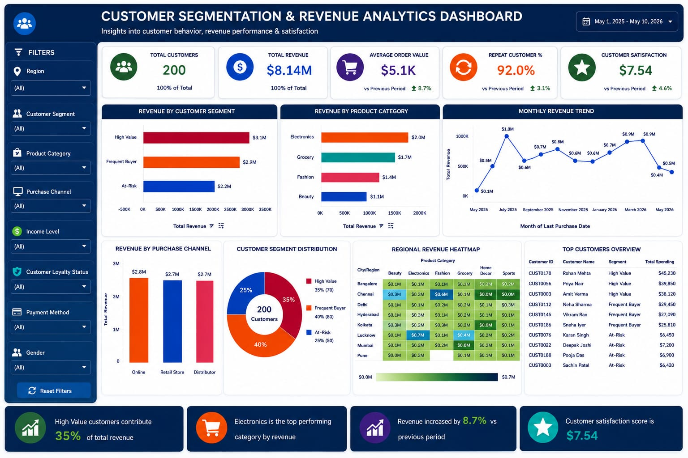

 # Customer Segmentation & Revenue Analytics Dashboard

## 📌 Project Overview

The Customer Segmentation & Revenue Analytics Dashboard is an interactive Tableau project designed to analyze customer behavior, revenue performance, purchasing patterns, customer satisfaction, and retention trends. The dashboard enables businesses to identify valuable customer segments, evaluate product performance, monitor revenue growth, and support data-driven decision-making.

This project demonstrates the use of Tableau's analytical and visualization capabilities to transform raw customer data into meaningful business insights through KPI-driven dashboards and interactive reporting.

## 🎯 Project Objectives

- Analyze overall revenue performance.
- Identify High Value, Frequent Buyer, and At-Risk customers.
- Measure customer retention through repeat purchase analysis.
- Evaluate product category performance.
- Monitor monthly revenue trends.
- Analyze purchase channel effectiveness.
- Track customer satisfaction levels.
- Generate actionable business insights for decision-making.

## 🛠️ Tools & Technologies Used

- Tableau Public 
- Microsoft Excel
- Data Visualization
- Business Intelligence
- Customer Analytics

---

## 📂 Dataset Description

The dataset contains customer demographic, transactional, and behavioral information, including:

Field Name| Description
Customer ID| Unique customer identifier
Customer Name| Customer name
Age| Customer age
Gender| Male/Female
City/Region| Customer location
Occupation| Customer profession
Income Level| Income category
Product Category| Purchased product category
Product Name| Purchased product
Purchase Frequency| Number of purchases
Total Spending| Total customer spending
Purchase Channel| Online, Retail Store, Distributor
Customer Loyalty Status| Loyalty membership status
Customer Satisfaction Score| Customer rating
Last Purchase Date| Most recent purchase date

---

## 📊 Key Performance Indicators (KPIs)

#### 💰 Total Revenue

Overall revenue generated from all customers.

#### 👥 Total Customers

Total number of unique customers.

#### 🛒 Average Order Value (AOV)

Average revenue generated per purchase.

#### 🔄 Repeat Customer %

Percentage of customers who made repeat purchases.

#### ⭐ Customer Satisfaction Score

Average customer satisfaction rating.

---

## 📈 Dashboard Features

##### Revenue by Customer Segment

Analyzes revenue generated by High Value, Frequent Buyer, and At-Risk customers.

##### Revenue by Product Category

Compares revenue contribution across product categories.

##### Monthly Revenue Trend

Tracks revenue performance and customer spending patterns over time.

##### Customer Segment Distribution

Visualizes customer composition through segmentation analysis.

##### Revenue by Purchase Channel

Compares revenue generated through Online, Retail Store, and Distributor channels.

##### Regional Revenue Heatmap

Highlights revenue performance across different regions.

##### Income Level vs Spending Analysis

Examines spending behavior across different income groups.

### Interactive Filters

Enables dynamic dashboard exploration using:

- Region
- Customer Segment
- Product Category
- Purchase Channel
- Income Level
- Customer Loyalty Status
- Payment Method
- Gender

---

## 🧮 Calculated Fields Used

##### Total Revenue

SUM([Total Spending])

##### Average Order Value

SUM([Total Spending]) / SUM([Purchase Frequency])

##### Repeat Customer Flag

IF [Purchase Frequency] > 1 THEN 1
ELSE 0
END

##### Repeat Customer %

SUM([Repeat Customer Flag]) / COUNTD([Customer ID])

##### Customer Segmentation

IF [Total Spending] >= 30000 THEN "High Value"
ELSEIF [Purchase Frequency] >= 5 THEN "Frequent Buyer"
ELSE "At-Risk"
END

---

## 🔍 Key Insights

- Total Revenue reached $8.14M.
- Total customer base consists of 200 customers.
- Average Order Value is approximately $5.1K.
- Repeat Customer Rate stands at 92%.
- High Value customers contribute the highest share of revenue.
- Electronics is the top-performing product category.
- Online purchases generate significant revenue contribution.
- Customer satisfaction remains consistently positive.
- Regional analysis identifies strong-performing markets.
- Customer segmentation supports targeted marketing and retention strategies.

---

## 📷 Dashboard Preview

---

## 📁 Project Structure

customer-segmentation-revenue-analytics-dashboard/
│
├── Customer_Segmentation_Dashboard.twb
├── customer_segmentation_dataset.xlsx
├── dashboard_Screenshot.jpeg
└── README.md

---

## 🏁 Conclusion

This dashboard provides a comprehensive view of customer behavior, revenue performance, and purchasing trends. By combining customer segmentation, KPI monitoring, regional analysis, and interactive visualizations, the project enables businesses to uncover actionable insights, improve customer retention, and make informed strategic decisions.

## Author

Nikhat Jahan
